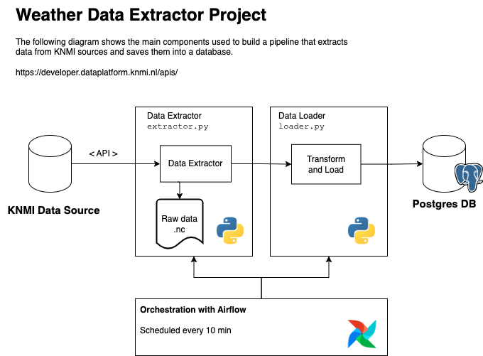

# Weather Data Extractor
A solution to extract weather data from public sources.

## Solution

This is a simple solution developed fully in Python.

The following diagram shows the main components used to build a data pipeline that extracts data from KNMI sources and saves the data to a database.



## How to install

### Using docker (recommended)

```
docker compose up --build
```


### Without docker

1. Get an api key from https://developer.dataplatform.knmi.nl/apis/ and write it in the `.env` file. You can use the file `.env_sample` as an example.

2. Create and activate a virtual environment

```
python -m venv venv
source venv/bin/activate
```

2. Install the required dependencies 

```
pip install -r requirements.txt
```

3. Get an api key from https://developer.dataplatform.knmi.nl/apis/ and write it in the `.env` file. You can use the file `.env_sample` as an example.

4. Load the environment variables 

```
source .env
```

## Details

By default, the intermediated data is downloaded in a folder named `data`.

The data will be available in the table `weather`.