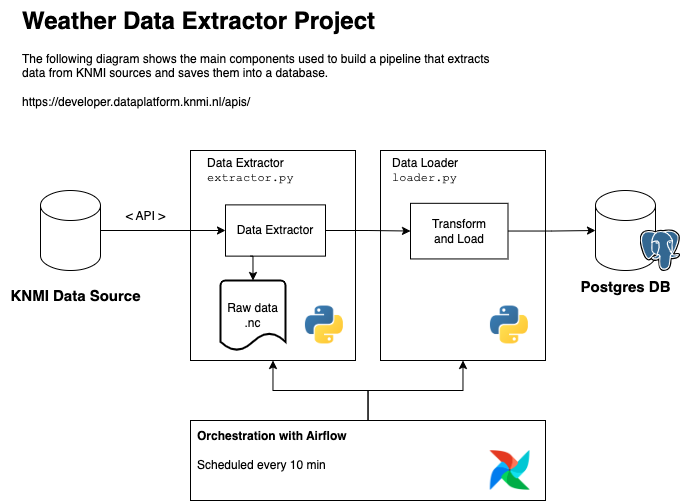

# Weather Data Extractor
A solution to extract weather data from public KNMI sources.

## Solution

This is a simple solution developed fully in Python.

The following diagram shows the main components to build a data pipeline that extracts data from KNMI sources and saves the data to a database.

https://developer.dataplatform.knmi.nl/apis/

### Design decisions

* Postgresql is selected as the database engine because of its features, documentation, and well-known open-source community.
* Airflow is selected as the orchestration tool since it allows for easy set-up and monitoring of DAGs written in Python.
* The DAG schedule must be every 10 minutes since the weather stations report every 10 minutes. See https://dataplatform.knmi.nl/dataset/actuele10mindataknmistations-2
* The class `WeatherDataExtractor` (`extractor.py`) is created for data extraction tasks. This class manages the connection, and API key provisions, and also saves the raw dataset in a folder for backup purposes.
* The class `DataLoader` (`loader.py`) manages the load step. It is in charge of establishing the connection to the database and saving the file contents to a table in the database.
* Currently, the `DataLoader` includes a transformation step. The simple transformation includes reading the `.nc` file and converting it into a pandas data frame. This data frame is used for saving into the database. 
* As future work, the transformation step should be extracted into a new class to have a better separation of concerns. 
* Another future work is to write unit tests to ensure data quality across the pipeline.
